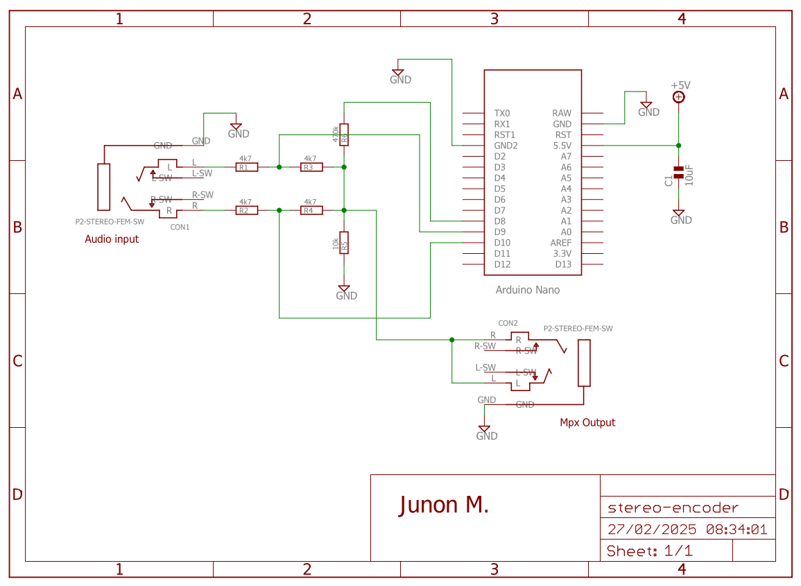

# Arduino Stereo Encoder

## Description

- This code generates a stereo signal via software, alternately connecting the left and right channels to the gnd, while mixing the pilot sync signal.

## Features

- **Frequency Precision**: +-2.5Hz to pilot signal

## Requirements

- **Arduino IDE**: To compile the sketch.
- **Board Compatibility**: Uno, Nano, and compatibles.

## Schematic

## Author

- **Junon M.**  
  Contact: [junon10@tutamail.com](mailto:junon10@tutamail.com)

## Contributing

Contributions are welcome! Please fork the repository and send a pull request.

## Repository

- [https://github.com/junon10/arduino-stereo-encoder](https://github.com/junon10/arduino-stereo-encoder)

## References

- Arduino Documentation

## Changelog

- **v1.0.0 (2024/06/24)**: Initial commit.

## License

- GNU GENERAL PUBLIC LICENSE Version 3, 29 June 2007

